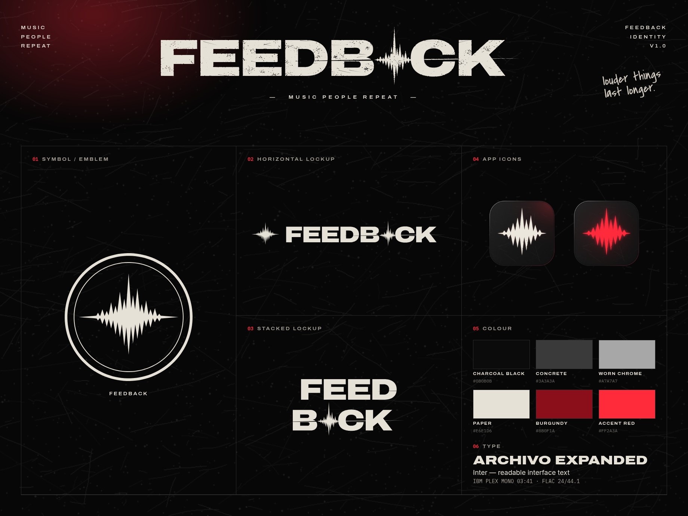

<p align="center"></p>

# FEEDBACK

**Music people repeat.** A local-first player for the music and music videos you own — Windows desktop app plus a
phone app served from your own computer. No account, no ads, no telemetry, no cloud.

## Use it
- **Install:** run `src-tauri/target/release/bundle/nsis/FEEDBACK_<version>_x64-setup.exe` (built with `pnpm tauri build`).
  Unsigned: SmartScreen → *More info → Run anyway*.
- **Add music:** Home → *Import music*, or drag folders/files onto the window. See `docs/MEDIA_IMPORT.md`.
- **Phone:** Settings → Devices → turn on phone access, follow the setup page. See `docs/MOBILE.md`.

## Develop (Windows)
```powershell
pnpm install
pnpm tauri dev        # needs MSVC build tools on PATH (this machine: .sync\msvc.cmd pnpm tauri dev)
pnpm test             # vitest (queue, lyrics parser)
cd src-tauri; cargo test --lib   # migrations, scanner helpers, playlists, Range, downloads, 20k-track perf
pnpm build:pwa        # phone app → dist-pwa (bundled into the installer)
pnpm tauri build      # release + NSIS installer
```
Test library: `python tests/fixtures/generate.py` (synthetic audio + covers; invented band names).
Screenshot QA: `docs/ARCHITECTURE.md → Dev loop`.

## Layout
| Path | What |
|---|---|
| `src/` | React UI — `features/*`, `components/`, `state/`, `services/` (Tauri / LAN / offline data access) |
| `src-tauri/src/` | Rust — `library/` (scan, query, store, watch), `database/`, `metadata/`, `media.rs`, `transcode.rs`, `sync/` (LAN server), `downloads/` |
| `brand/` | Logo system, icons, textures, renders, screenshots, social, wallpapers, motion, press kit, `BRAND_GUIDE.md` |
| `design/` | Generators for every brand asset, Blender scene script + `.blend`, GLB exports |
| `docs/` | `MASTER_PLAN`, `ARCHITECTURE`, `DESIGN_SYSTEM`, `MEDIA_IMPORT`, `MOBILE`, `IOS`, `RELEASE` |
| `site/` | Optional static landing page |

## Principles
Local files stay where they are. Media is served to the UI by id, never by path. Every control does something.
It never rips, unlocks or downloads from streaming services.
